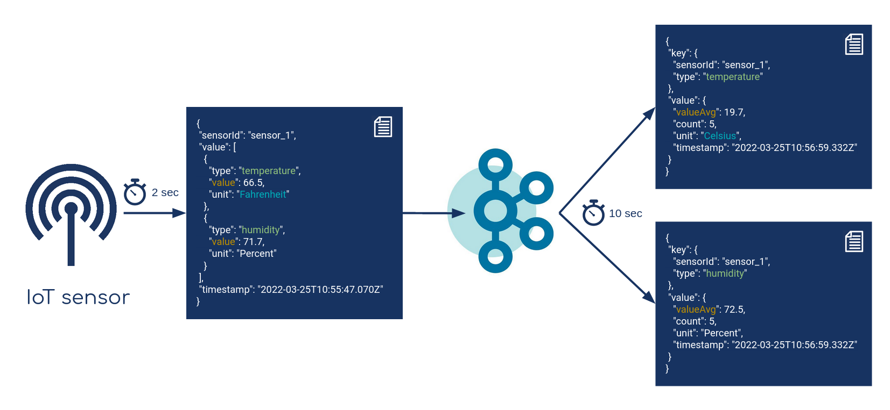
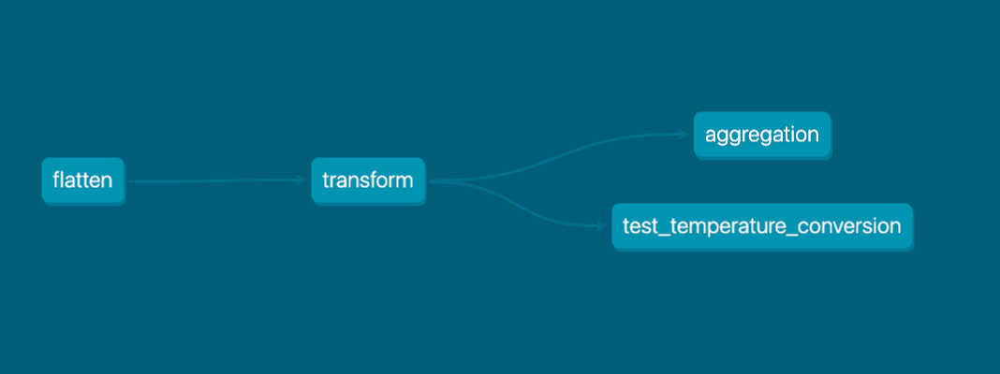
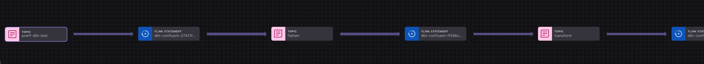
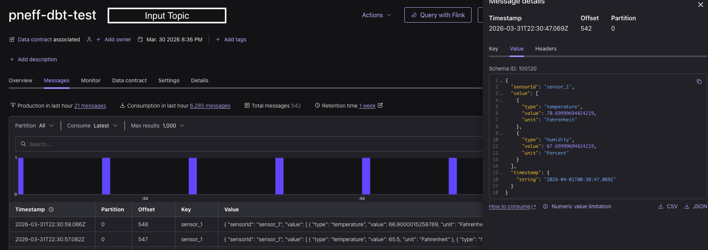
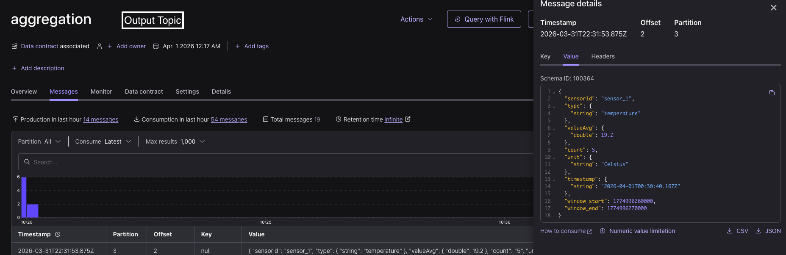

# Stream Processing in Confluent Cloud Flink with data build tool (dbt)

The goal is to implement, test, and deploy a stream processing pipeline with Flink SQL using [dbt](https://www.getdbt.com/).
We will document each step and share some experiences at the end of this README [here](https://github.com/pneff93/dbt-cc-stream-processing/tree/main?tab=readme-ov-file#final-comments).

In more detail, we have a sensor sending continuously temperature and humidity data as one event. Finally, we want to have
separate events per
measurement type plus a conversion of the temperature from Fahrenheit to Celsius. This requires `flatten`, `transform`, and `aggregation`
steps.

The sensor producer can be found [here](https://github.com/pneff93/stream-processing-playground/tree/main/KafkaProducer).
It produces an event every 2 seconds, resulting in 84B/s ingress.

A graphical representation can be seen here:



## Installation

* [Confluent documentation](https://docs.confluent.io/cloud/current/flink/operate-and-deploy/deploy-flink-dbt.html#step-1-install-the-dbt-confluent-adapter)
* [dbt documentation](https://docs.getdbt.com/docs/local/install-dbt?version=1.12)

We install dbt Core and the dbt Confluent adapter

```shell
pip install dbt-confluent
dbt --version
```
```shell
Core:
  - installed: 1.11.7
  - latest:    1.11.7 - Up to date!

Plugins:
  - confluent: 0.1.0 - Up to date!
```

We initialize our project
```shell
dbt init temperature_transform
```
Here, we need to pass some information, e.g. CC resource IDs. I highly recommend verifying 
`~/.dbt/profiles.yml` because some concepts have different namings between dbt, Flink and Confluent Cloud.

```yaml
temperature_transform:
  outputs:
    dev:
      cloud_provider: azure
      cloud_region: westeurope
      compute_pool_id: <lfcp-abc>
      dbname: <cluster name>               <-- the cluster name; not the cluster id
      environment_id: <env-abc>
      flink_api_key: <Flink API Key>
      flink_api_secret: <Flink API Secret>
      organization_id: <org ID>
      statement_label: pneff-dbt
      threads: 1
      type: confluent
  target: dev
```

We test our connection 
```shell
cd temperature_transform
dbt debug
```

```shell
...
18:23:24  Registered adapter: confluent=0.1.0
18:23:35    Connection test: [OK connection ok]
```

## Develop the stream processing pipeline
In total, we need 3 processing steps:
* flatten
* transform
* aggregate

In addition, we want to have some data tests and a unit test. We will go step-by-step through the statement development, testing,
and deployment for the transform (Fahrenheit --> Celsius) statement.

### Project overview

* [Materializations](https://github.com/confluentinc/dbt-confluent/blob/main/MATERIALIZATIONS.md)
* [CREATE TABLE AS SELECT (CTAS)](https://docs.confluent.io/cloud/current/flink/reference/statements/create-table.html#create-table-as-select-ctas)

In our project, we configure every table as a materialized view. This corresponds to a CC Flink table created via `CREATE TABLE AS SELECT...`
```yaml
models:
  temperature_transform:
    intermediate:
      +materialized: materialized_view
    marts:
      +materialized: materialized_view
```

### Structure overview
* [dbt guide structure overview](https://docs.getdbt.com/best-practices/how-we-structure/1-guide-overview?version=1.12#guide-structure-overview)

We follow the common naming strategy of our models using intermediate, and marts.
```shell
├── models
│   ├── intermediate
│   │       ├── flatten.sql   
│   │       └── flatten.yml    
│   │       └── transform.sql  <-- actual statement
│   │       └── transform.yml  <-- data test
│   ├── marts
│   │       ├── aggregation.sql
│   │       └── aggregation.yml
└── tests
    └── transform.yml         <-- unit test
```

### Statement

The transform statement can be found in `models/intermediate/transform.sql`

```roomsql
SELECT
  `sensorId`,
  `value`.`type` AS `type`,
  CASE
    WHEN `value`.`unit` = 'Fahrenheit' AND `value`.`type`= 'temperature'
     THEN 'Celsius'
    ELSE `value`.`unit`
   END AS `unit`,
  CASE
    WHEN `value`.`unit` = 'Fahrenheit' AND `value`.`type`= 'temperature'
    THEN (`value`.`value` - 32) / 1.8
    ELSE `value`.`value`
  END AS `value`,
  `timestamp`
FROM {{ ref('flatten') }}
WHERE `sensorId` IS NOT NULL
```

> [!NOTE]
> 1. Note, when adding a ";" (semicolon) the statement fails
> 2. We refer to the upstreaming processing statement via `FROM {{ ref('flatten') }}`

Deploy the statement
```shell
dbt run
```

```shell
...
22:17:42  Finished running 3 materialized view models in 0 hours 0 minutes and 33.52 seconds (33.52s).
22:17:42  
22:17:42  Completed successfully
22:17:42  
22:17:42  Done. PASS=3 WARN=0 ERROR=0 SKIP=0 NO-OP=0 TOTAL=3
```

### Data tests
* [dbt data tests](https://docs.getdbt.com/reference/resource-properties/data-tests?version=1.12)

The data test for the transform statement can be found in `models/intermediate/transform.yml`.
We want to test if the `sensorId` is always set and if only percent for humidity and Celsius for temperature as units are possible.

```yaml
models:
  - name: transform
    description: "Intermediate model that transforms sensor data"
    columns:
      - name: sensorId
        description: "The identifier for the sensor"
        tests:
          - not_null
      - name: unit
        data_tests:
          - accepted_values:
              arguments:
                values: ['Percent', 'Celsius']
```

```shell
dbt test or
dbt test --select test_type:data  
```

```shell
...
19:46:50  Finished running 1 test in 0 hours 0 minutes and 13.52 seconds (13.52s).
19:46:50  
19:46:50  Completed successfully
19:46:50  
19:46:50  Done. PASS=1 WARN=0 ERROR=0 SKIP=0 NO-OP=0 TOTAL=1
```

> [!NOTE]
> Based on my experience, the corresponding table needs to exist in Confluent Flink beforehand to run the test successfully. Otherwise,
> I received the error `Table (or view) 'flatten' does not exist...`

### Unit tests

* [dbt unit tests](https://docs.getdbt.com/docs/build/unit-tests?version=1.12)

The unit test for the transform statement can be found in `tests/transform.yml`
We want to test if the input events will be correctly processed by comparing them to the expected output ones.

```yaml
unit_tests:
  - name: test_temperature_conversion
    model: transform
    given:
      - input: ref('flatten')
        format: sql
        rows: |
          SELECT
            'sensor_1' AS `sensorId`,
            CAST(ROW('temperature', 'Fahrenheit', 68.0) AS ROW<`type` STRING, `unit` STRING, `value` DOUBLE>) AS `value`,
            '2026-03-31T23:27:17.695Z' AS `timestamp`
          UNION ALL
          SELECT
            'sensor_2' AS `sensorId`,
            CAST(ROW('humidity', 'Percent', 55.0) AS ROW<`type` STRING, `unit` STRING, `value` DOUBLE>) AS `value`,
            '2026-03-31T23:27:17.695Z' AS `timestamp`
    expect:
      rows:
        - sensorId: "sensor_1"
          type: "temperature"
          unit: "Celsius"
          value: 20.0
          timestamp: "2026-03-31T23:27:17.695Z"
        - sensorId: "sensor_2"
          type: "humidity"
          unit: "Percent"
          value: 55.0
          timestamp: "2026-03-31T23:27:17.695Z"
```


```shell
dbt test or
dbt test --select test_type:unit
```

```shell
...
22:29:40  Finished running 1 unit test in 0 hours 0 minutes and 46.60 seconds (46.60s).
22:29:40  
22:29:40  Completed successfully
22:29:40  
22:29:40  Done. PASS=1 WARN=0 ERROR=0 SKIP=0 NO-OP=0 TOTAL=1
```

> [!NOTE]
> It was quite a challenge to get the right form for the input events and required several iterations.

### Lineage Graph

* [Confluent documentation](https://docs.confluent.io/cloud/current/flink/operate-and-deploy/deploy-flink-dbt.html#understand-downstream-impact)

Finally, we want to visualize our data flow. We do this once with dbt and once in Confluent Cloud Stream Lineage view.

```shell
dbt docs generate
dbt docs serve
```




## Confluent Cloud

We add some screenshots from Confluent Cloud to verify that our stream processing pipeline works as expected.





## Final Comments

### dbt labs experience

It took some time to get used to how dbt works but once the first statements were developed and tested it felt more and more naturally.
Even though in my first iterations it was not a test driven development (which I would always recommend), I am pretty convinced
dbt is a great tool going into that direction, especially with unit tests. 

### Confluent Cloud resources

I was really surprised that my compute pool requested up to 18 CFUs at some point in time. For a rather simple pipeline,
Checking further, I have seen that some statements were not cleaned up even though running them with `dbt run --full-refresh`.
This is already a known bug and should be fixed soon

### Confluent Cloud Fink particularities

Sometimes, the  Confluent Cloud Flink particularities (e.g. metadata fields like rowtime) made it difficult to write the actual statements or unit tests.
Or in different words, it requires a bit Confluent Cloud Flink knowledge to develop everything properly.


